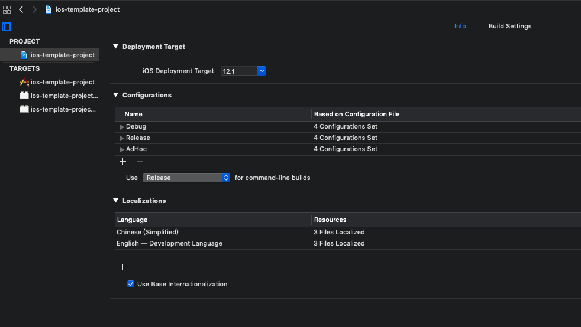
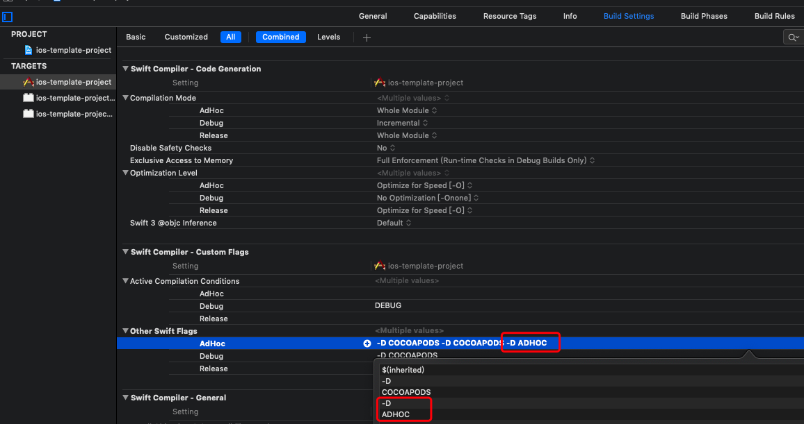
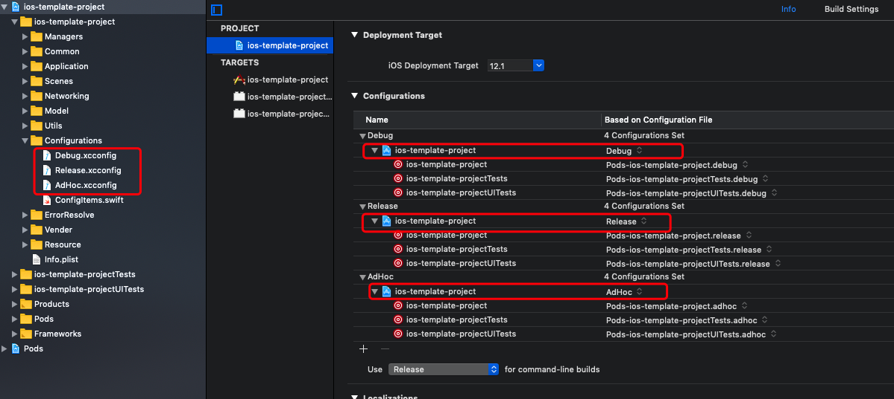
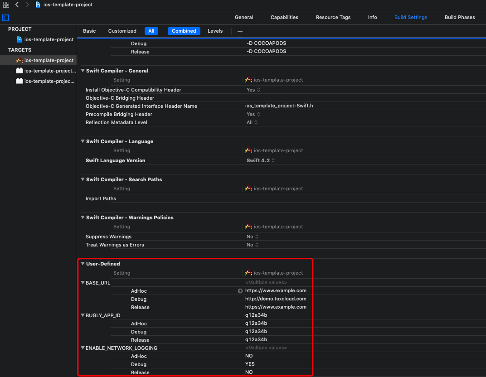
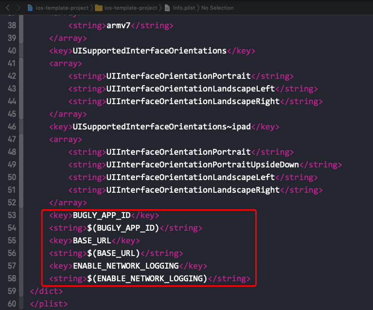
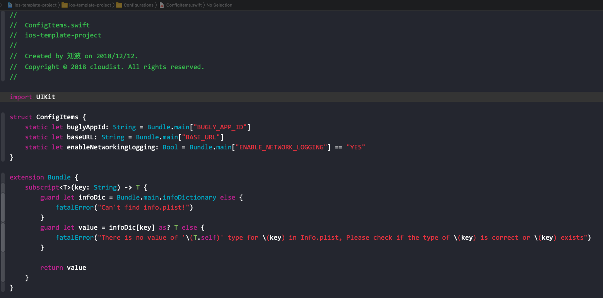

## 项目结构
``` bash
├── Application
│   ├── AppDelegate+PushNotification.swift #推送相关代码
│   ├── AppDelegate.swift
│   ├── Application.swift #单例类、初始屏幕管理
│   └── Navigator
│       ├── Navigator.swift #导航控制
│       ├── Scence.swift #业务场景的enumeration
│       └── Transition.swift #转场控制
├── Common #各种基类
│   ├── BarButtonItem.swift
│   ├── NavigationController.swift
│   ├── StackView.swift
│   ├── TableView.swift
│   ├── TableViewController.swift
│   ├── View.swift
│   ├── ViewController.swift #viewController基类
│   └── ViewModel.swift #ViewModel基类
├── Configurations #工程配置项
│   ├── AdHoc.xcconfig
│   ├── ConfigItems.swift
│   ├── Debug.xcconfig
│   └── Release.xcconfig
├── ErrorResolve #错误处理
│   └── ErrorResolvable.swift
├── Info.plist
├── Managers
│   ├── AuthManager.swift #Token管理
│   ├── LibsManager.swift #libs注册配置管理
│   └── LogManager.swift #日志
├── Model #模型类
│   ├── ErrorResponse.swift
│   ├── LoginResponse.swift
│   ├── Token.swift
│   └── User.swift
├── Networking #网络配置
│   ├── DataRepository.swift
│   ├── EndPoint #endpoint
│   │   └── AccountApi.swift
│   ├── NetworkConfig.swift #配置
│   └── Reachability.swift #reachability
├── Resource
│   ├── Assets.xcassets #资源
│   │   ├── AppIcon.appiconset
│   │   ├── Contents.json
│   │   ├── back.imageset
│   │   ├── cancel.imageset
│   │   ├── check.imageset
│   │   ├── empty_content.imageset
│   │   └── error.imageset
│   ├── Base.lproj
│   │   ├── LaunchScreen.storyboard
│   │   └── Main.storyboard
│   ├── en.lproj #国际化string文件 en
│   │   └── Localizable.strings
│   └── zh-Hans.lproj #国际化string文件 zn-ch
│       ├── LaunchScreen.strings
│       ├── Localizable.strings
│       └── Main.strings
├── Scenes #业务场景
│   ├── Login
│   │   ├── LoginViewController.swift
│   │   └── LoginViewModel.swift
│   ├── Main
│   │   ├── HomeTabBarController.swift
│   │   └── HomeTabBarViewModel.swift
│   ├── Profile
│   │   ├── ProfileViewController.swift
│   │   └── ProfileViewModel.swift
│   └── Sample
│       ├── SampleViewController.swift
│       └── SampleViewModel.swift
├── Utils
│   ├── CustomFont #自定义字体
│   │   ├── CustomFont.swift
│   │   └── consola.ttf
│   ├── Extension # 项目级别的 extension
│   │   └── StringExtensions.swift
│   └── HUD #HUD 相关
│       ├── UIViewController+HUD.swift
│       └── UIViewControllerHUD+Rx.swift
└── Vender
    ├── RxActivityIndicator #活动指示器
    │   └── RxActivityIndicator.swift
    └── RxErrorTracker #错误捕捉
        └── RxErrorTracker.swift
```

## 项目配置
除预设的 `Debug` 和 `Release` 两个 Configuration 外， 新建了`AdHoc`(duplicate 自`Release`)，方便区分环境，线上用 `Release`、测试用 `AdHoc`,开发用 `Debug`.


对于 `AdHoc` 环境添加了 `ADHOC` 标识符


在代码中可以通过如下代码区分环境
```swift
#if DEBUG
#elseif ADHOC
#endif
```
为避免代码中出现太多的上述代码，工程中分别新建了对应的配置文件(`.xcconfig`), 分别设置到了对应的 `Configuration` 上


这样就会在 `Target` 下的 `User-Defined` 下出现相应的设置项


这些信息会在编译时可以读取到，因此在 `Info.plist`中添加代码将去保存到 `Info.plist` 中。


可以通过工程 `Configuration` 目录下的 `ConfigItems.swift`中定义的 `ConfigItems` 读取


## 项目架构
**MVVM**

项目中的示例代码采用 `Rx` 来实现 `MVVM`。如不熟悉 `MVVM`，也可采用 `MVC` 模式。

## 网络相关
本项目使用 `Moya` 作为网络层，相关代码位于项目的 `Networking` 目录下。`JSON` 转 `Model`使用 `swift` 标准库提供的 `Codable`协议，相关代码位于 `Model`目录下。

如需修改网络配置，尽量不要直接使用  `Alamofire`，而是对 `Moya`提供的 `Provider`进行修改，代码在 `NetworkConfig.swift` 中。

`Reachability.swift` 中提供了网络是否连通的代码，并通过 `Observable<Bool>` 向外发送状态。

`DataRepository.swift`：将 `Moya` 的 `endpoint` 变成可监听的网络请求
`EndPoint/**.swift`: 各个模块的 `endpoint`

## 页面跳转
项目中的页面跳转统一由 `Navigator` 类来完成，基类 `ViewController` 遵从了 `Navigatable` 协议。在访问 `Viewcontroller` 的 `navigator!` 属性前请先对其赋值，详见代码 `Navigator.swift`。

项目中的需要显示的页面都需要向 `Navigator.Scence` 枚举中注册并添加初始化对应 `viewController` 的代码。代码位于 `/Application/Navigator/Scence.swift`。

## Loading 动画
项目中的 `HUD` 简单地封装了 `MBProgressHUD`，并提供了 `Rx` 扩展。代码位于 `/Utils/HUD/`目录下的 `UIViewController+HUD.swift`和 `UIViewControllerHUD+Rx.swift`两个文件中

## 资源管理
本项目使用 `R.swift`框架管理资源，该框架生成的 `R.generated.swift` 不要加入版本管理中。每次 build 的时候会自动在项目根目录生成。所以在从本模板生成新项目后需要先 build 新项目一两次

## 代码规范
使用 `swiftLint` 规范代码，每次 build 时会将警告和错误显示在 xcode 中，规则配置位于 项目根目录的 `.swiftlint.yml`中。